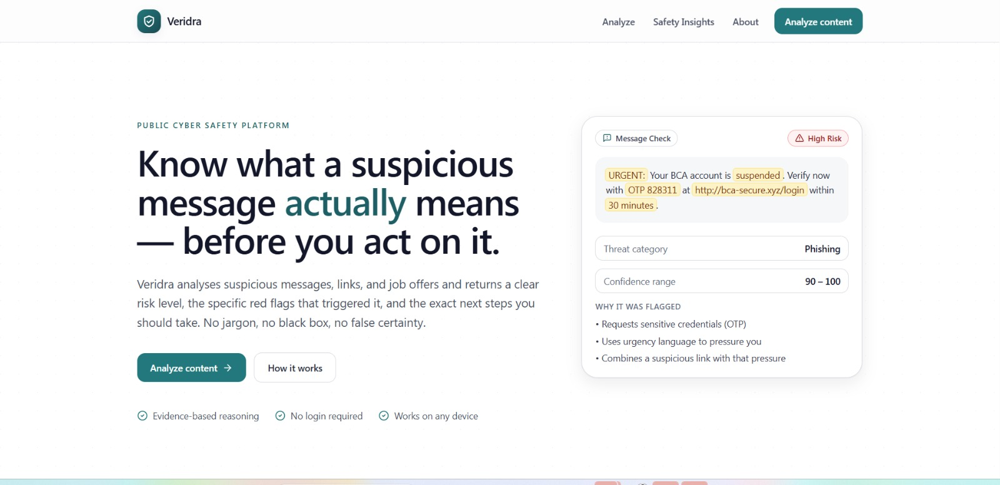
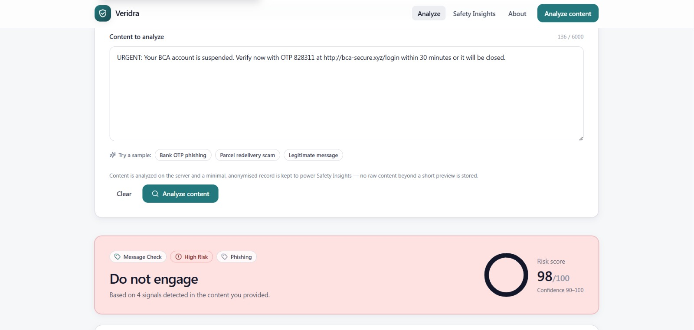
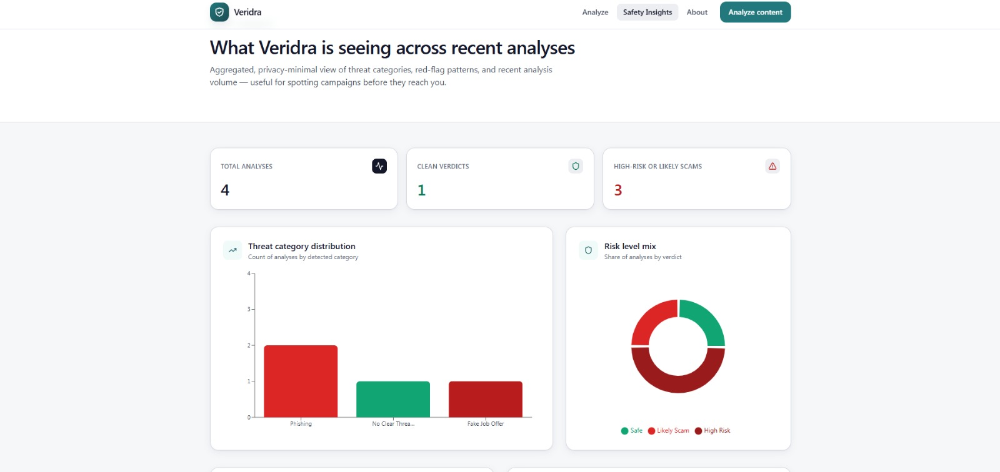

# Veridra

> **A public cyber safety platform for suspicious messages, unsafe links, and fake job offers.**

Veridra takes the digital content an ordinary person is already unsure about, a strange SMS, a suspicious URL, an aggressive recruiter DM, and returns a clear risk verdict, the specific red flags that triggered it, and the exact next steps they should take. It is explainable by design, evidence-based in its reasoning, and careful never to overclaim certainty or take action on anyone's behalf.

## Live Demo
https://veridra-cyber-safety.vercel.app/
---

## Table of Contents

1. [Overview](#overview)
2. [Problem Statement](#problem-statement)
3. [Public Value](#public-value)
4. [Main Features](#main-features)
5. [The Three Analysis Modes](#the-three-analysis-modes)
6. [The Six Output Layers](#the-six-output-layers)
7. [Tech Stack](#tech-stack)
8. [Project Structure](#project-structure)
9. [Setup](#setup)
10. [Running Locally](#running-locally)
11. [Risk Scoring Logic](#risk-scoring-logic)
12. [Why Explanation Layers Matter](#why-explanation-layers-matter)
13. [Block & Report Guidance](#block--report-guidance)
14. [Limitations](#limitations)
15. [Disclaimer](#disclaimer)
16. [Future Improvements](#future-improvements)
17. [Screenshots](#screenshots)
18. [Author](#author)
19. [License](#license)

---

## Overview

Veridra is a modular, full-stack web platform built around a single idea: a security verdict is only useful if the person receiving it understands *why*. Pasting a suspicious message, URL, or job offer returns:

- A clear **Risk Level** and 0–100 score with a confidence range
- The specific **Threat Category** (phishing, OTP scam, fake job offer, etc.)
- **Why it was flagged** — tied to the exact phrase, domain, or pattern seen
- **Why you should not proceed** — realistic consequences in plain language
- **Recommended safe action** — concrete next steps tailored to the threat
- **Block & report guidance** — platform-agnostic steps the user can take

The result experience is the centerpiece: clean, serious, and built to be read and acted on in under a minute.

## Problem Statement

Most financial loss from digital fraud does not come from advanced exploits. It comes from routine messages, DMs, and emails that convince someone to share an OTP, click a convincing-looking link, or pay a "registration fee" for a job that does not exist. Professional security tools exist, but they are built for enterprise defenders — not for someone checking a suspicious SMS at a bus stop.

Veridra closes that gap for ordinary users.

## Public Value

- **Accessibility.** No login, no account, works on any device.
- **Explainability.** Every verdict shows its reasoning, so users learn the red flags over time.
- **Responsibility.** Veridra never blocks, reports, or replies to anything automatically. It gives guidance — the user stays in control.
- **Coverage.** Message, link, and job-offer analysis cover the three content types where everyday social-engineering attacks happen most.

## Main Features

- Three analysis modes: **Message Check**, **Link Check**, **Job Offer Check**
- 6-layer structured output for every analysis
- Risk scoring with confidence range
- Evidence-tied explanation engine — suspicious phrases are highlighted in the input
- Safety Insights dashboard: category distribution, risk-level mix, top red flags, recent analyses
- Clean, premium, trust-first UI
- Privacy-minimal persistence: only mode, category, score, level, signal IDs, and a truncated preview are stored

## The Three Analysis Modes

| Mode | Looks for |
|---|---|
| **Message Check** | Urgency pressure, OTP/credential requests, brand impersonation, reward bait, financial fraud wording, coercive threats, link + pressure combos |
| **Link Check** | Abuse-prone TLDs, URL shorteners, raw-IP hosts, typosquatted domains (Levenshtein ≤ 2 from known brands), brand-in-subdomain tricks, excessive subdomains, punycode, login-style paths on disposable hosts, HTTP-not-HTTPS |
| **Job Offer Check** | Unrealistic pay, upfront fees or deposits, rushed hiring without interviews, premature requests for ID or bank details, mule-style roles, off-channel contact pushes (WhatsApp / Telegram), free-email recruiters, no verifiable company |

## The Six Output Layers

| # | Layer | Purpose |
|---|---|---|
| 1 | **Risk Level** | Safe / Low Risk / Suspicious / Likely Scam / High Risk — plus a 0–100 score and confidence range |
| 2 | **Threat Category** | Phishing, Fake Job Offer, Suspicious Link, OTP Scam, Impersonation, Financial Fraud, or Unknown Suspicious Pattern |
| 3 | **Why It Was Flagged** | The specific patterns triggered, with the exact evidence that matched |
| 4 | **Why You Should Not Proceed** | Realistic consequences of engaging, in plain language |
| 5 | **Recommended Safe Action** | Concrete next steps, tailored to the threat category and signals |
| 6 | **Block & Report Guidance** | Platform-agnostic steps to block the sender and report the content |

## Tech Stack

**Frontend**
- Next.js 14 (App Router), TypeScript
- Tailwind CSS for styling
- Recharts for the Safety Insights dashboard
- Lucide icons
- Hand-rolled UI primitives in the shadcn/ui visual style (no generator step required)

**Backend**
- FastAPI on Python 3.11+
- Pydantic v2 for request/response schemas
- `tldextract` for URL structural analysis
- SQLite for privacy-minimal persistence (analysis history + insight aggregates)
- Modular monolith architecture — one process, cleanly separated modules

## Project Structure

```
veridra/
├── backend/
│   ├── requirements.txt
│   └── app/
│       ├── main.py                       # FastAPI app, routes, CORS, DB init
│       └── modules/
│           ├── schemas.py                # Shared Pydantic models & enums
│           ├── message_analysis.py       # Message red-flag detectors
│           ├── link_analysis.py          # URL heuristic analysis
│           ├── job_offer_analysis.py     # Recruiter-scam detectors
│           ├── risk_scoring.py           # Signal → 0–100 score + band
│           ├── explanation_engine.py     # Signal → human-readable reasoning
│           ├── safe_action_guidance.py   # Layer 5 generation
│           ├── block_report_guidance.py  # Layer 6 generation
│           ├── data_access.py            # SQLite history & aggregates
│           └── pipeline.py               # Orchestrator called by the API
└── frontend/
    ├── package.json
    ├── next.config.js
    ├── tailwind.config.js
    └── src/
        ├── app/
        │   ├── layout.tsx                # Shared header/footer shell
        │   ├── page.tsx                  # Landing
        │   ├── analyze/page.tsx          # Core interaction page
        │   ├── insights/page.tsx         # Safety Insights dashboard
        │   └── about/page.tsx            # Platform motivation & methodology
        ├── components/
        │   ├── SiteHeader.tsx
        │   ├── SiteFooter.tsx
        │   ├── Logo.tsx
        │   ├── ModeTabs.tsx
        │   ├── ContentInput.tsx
        │   ├── HighlightedContent.tsx
        │   └── RiskVerdictPanel.tsx      # The 6-layer result experience
        └── lib/
            ├── api.ts
            ├── types.ts
            ├── risk.ts                   # Severity theming
            ├── signalLabels.ts
            └── cn.ts
```

## Setup

**Requirements.** Python 3.11+, Node.js 18.17+ (or 20+), npm.

### Backend

```bash
cd backend
python -m venv .venv
source .venv/bin/activate        # On Windows: .venv\Scripts\activate
pip install -r requirements.txt
```

### Frontend

```bash
cd frontend
npm install
cp .env.example .env.local       # Adjust NEXT_PUBLIC_API_URL if needed
```

## Running Locally

Run the backend and frontend in two terminals.

**Terminal 1 — API**
```bash
cd backend
source .venv/bin/activate
uvicorn app.main:app --reload --port 8000
```

**Terminal 2 — Web**
```bash
cd frontend
npm run dev
```

Then open **http://localhost:3000**.

The Next.js rewrite in `next.config.js` proxies `/api/*` to the FastAPI backend, so no CORS configuration is required for local development.

**API endpoints**

| Method | Path | Purpose |
|---|---|---|
| `POST` | `/api/analyze` | Run an analysis. Body: `{ "mode": "message" | "link" | "job_offer", "content": "..." }` |
| `GET` | `/api/insights` | Aggregated insights for the dashboard |
| `GET` | `/api/history?limit=N` | Recent analyses (anonymised preview only) |
| `GET` | `/api/health` | Liveness check |

## Risk Scoring Logic

Veridra's scorer is deliberately transparent rather than opaque.

1. **Signals.** Each analyzer returns a list of `Signal` objects, each carrying a severity (`low` / `medium` / `high` / `critical`) and the exact evidence that matched.
2. **Weighted aggregation.** Severities map to base weights: low 8, medium 18, high 30, critical 45.
3. **Diminishing returns.** Signals are sorted by severity descending and each subsequent signal contributes a smaller fraction of its weight (1.0, 0.7, 0.5, 0.35, 0.25…). This prevents a long, chatty message from runaway-scoring on many low-severity flags.
4. **Critical floor.** Any critical signal guarantees a minimum score of 75 — the scorer never under-calls a credential request or an upfront-fee job offer just because nothing else fired.
5. **Banding.** The final 0–100 score maps to `Safe` (<15), `Low Risk` (<35), `Suspicious` (<60), `Likely Scam` (<80), or `High Risk`.
6. **Confidence range.** Returned as `[score − spread, score + spread]`, where the spread narrows when multiple high-severity signals agree.

## Why Explanation Layers Matter

A standalone "this looks suspicious" verdict is security theater: it asks the user to trust a black box. Veridra's output is structured to teach, not just to label:

- **Layer 3 (Why it was flagged)** ties the verdict to observable evidence in the user's own content. They can see *why* the system thinks what it thinks.
- **Layer 4 (Why you should not proceed)** translates the signals into real-world consequences, not abstract risk language.
- **Layer 5 (Recommended safe action)** gives the user something to do — including recovery steps if they have already acted.

Over time, the reasoning itself becomes the lesson: users start recognising urgency pressure, brand-in-subdomain tricks, and upfront-fee jobs on their own.

## Block & Report Guidance

Layer 6 is intentionally advisory, not automated. Veridra does not:

- Block senders on the user's behalf
- Submit reports to any platform or authority
- Reply to, forward, or delete content

Instead, for each analysis it returns concrete, platform-agnostic steps — block via the app's built-in feature, report as spam or phishing, forward to the impersonated brand's abuse address, keep evidence before deletion, and so on. This keeps control with the user and avoids creating the illusion that Veridra is a law-enforcement or takedown system.

## Limitations

- **Heuristic, not oracular.** Veridra's analysis is rule- and pattern-based. Novel or carefully crafted attacks may evade detection, and legitimate content can occasionally match a pattern.
- **Language coverage.** English and Indonesian red-flag patterns are included. Other languages may under-trigger until their patterns are added.
- **No browser-level execution.** Link analysis is structural. Veridra does not follow redirects, render pages, or query threat-intelligence feeds.
- **Local persistence.** The default SQLite store is per-deployment; for production, swap `data_access.py`'s backend for Postgres.

## Disclaimer

Veridra is a **decision-support and educational tool**. It is not an official cybersecurity authority and does not replace law enforcement, your bank's fraud department, or formal incident response. Results should be treated as guidance, not as guarantees. When something matters — money, identity documents, or account access — verify through the sender's official channels before acting.

## Future Improvements

- Additional language packs (Malay, Tagalog, Thai, Vietnamese, Spanish, Portuguese)
- Optional ML classifier layer trained on curated phishing / fake-job corpora
- Pluggable threat-intelligence checks (Google Safe Browsing, PhishTank, URLHaus) behind a feature flag
- Account-free shareable result links for community education
- Admin panel for curating and versioning the red-flag pattern library

## Screenshots

*Add screenshots here once the UI is captured.*

- 
- 
- 

## Author

*Muhammad Abrar Rayhan*
Telkom University Jakarta
Machine Learning and Artificial inteligence enthusiast
## License

*MIT License*
